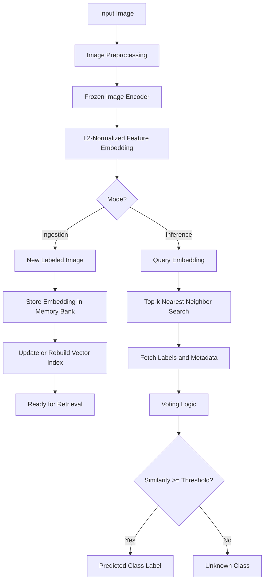
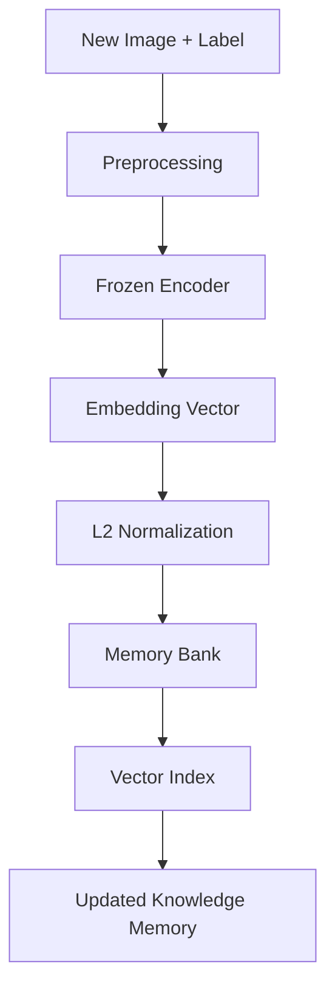
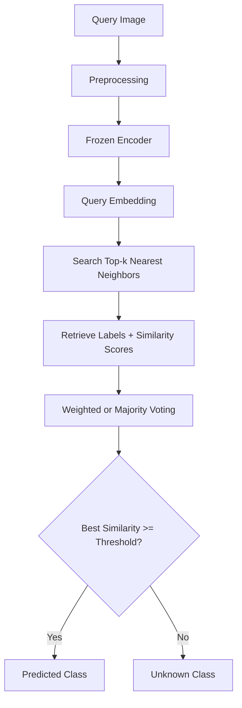

# CRISP: Continual Retrieval & Indexing System for Perception

**CRISP** is a lightweight Python library for **incremental image classification** using frozen visual encoders, vector-based retrieval, and voting-based classification.

Instead of retraining the model every time new data or new classes are added, CRISP stores image embeddings in a memory bank and retrieves the most similar samples during inference. This makes CRISP suitable for experiments in **incremental learning**, **retrieval-augmented classification**, and **image classification with expandable class memory**.

Repository:

```text
https://github.com/Hokimastah/CRISP
```

---

## 1. Main Idea

CRISP follows a simple principle:

```text
Image
→ Frozen Encoder
→ Feature Embedding
→ Vector Index
→ Top-k Retrieval
→ Voting
→ Predicted Class
```

The backbone is **frozen**, meaning its weights are not updated during incremental learning. New samples are added by extracting embeddings and storing them in the memory bank.

This design avoids representation drift and reduces the risk of catastrophic forgetting because old embeddings remain compatible with new embeddings as long as the same frozen encoder is used.

---

## 2. Key Features

- Frozen image encoder for stable feature extraction
- Incremental add-only memory update
- Retrieval-based classification
- Top-k nearest neighbor search
- Weighted voting and majority voting
- Optional unknown-class detection using similarity threshold
- Modular encoder backend
- Modular retrieval backend
- CLI support for indexing and prediction
- Installable as a Python library

---

## 3. Supported Components

### 3.1 Encoders

| Encoder | Description |
|---|---|
| `resnet18` | Frozen ResNet18 feature extractor |
| `resnet34` | Frozen ResNet34 feature extractor |
| `resnet50` | Frozen ResNet50 feature extractor |
| `resnet101` | Frozen ResNet101 feature extractor |
| `resnet152` | Frozen ResNet152 feature extractor |
| `clip` | Frozen CLIP image encoder using `open_clip_torch` |

### 3.2 Retrieval Backends

| Retriever | Description |
|---|---|
| `numpy` | Exact brute-force cosine retrieval using NumPy |
| `annoy` | Approximate nearest neighbor retrieval using Annoy |
| `faiss` | Similarity search using FAISS `IndexFlatIP` |

### 3.3 Voting Methods

| Voting | Description |
|---|---|
| `weighted` | Class score is calculated from the sum of similarity values |
| `majority` | Class score is calculated from the number of retrieved neighbors |

For most experiments, `weighted` voting is recommended because it considers both the retrieved class labels and their similarity scores.

---

## 4. Installation

### 4.1 Install from GitHub

```bash
pip install git+https://github.com/Hokimastah/CRISP.git
```

### 4.2 Install from GitHub with All Optional Backends

```bash
pip install "crisp[all] @ git+https://github.com/Hokimastah/CRISP.git"
```

### 4.3 Install Locally for Development

```bash
git clone https://github.com/Hokimastah/CRISP.git
cd CRISP
pip install -e .
```

### 4.4 Install with Optional Dependencies

Install Annoy support:

```bash
pip install -e ".[annoy]"
```

Install FAISS support:

```bash
pip install -e ".[faiss]"
```

Install CLIP support:

```bash
pip install -e ".[clip]"
```

Install all optional dependencies:

```bash
pip install -e ".[all]"
```

### 4.5 FAISS Installation Note

If `faiss-cpu` cannot be installed through `pip`, especially on some Windows environments, use Conda:

```bash
conda install -c pytorch faiss-cpu
```

---

## 5. Dataset Format

CRISP expects a folder-based image classification dataset.

```text
dataset/
├── class_a/
│   ├── image_001.jpg
│   ├── image_002.jpg
│   └── image_003.jpg
├── class_b/
│   ├── image_004.jpg
│   ├── image_005.jpg
│   └── image_006.jpg
└── class_c/
    ├── image_007.jpg
    └── image_008.jpg
```

The folder name is automatically used as the class label.

Example:

```text
dataset/cat/cat_001.jpg → label = cat
dataset/dog/dog_001.jpg → label = dog
```

Supported image formats:

```text
.jpg, .jpeg, .png, .bmp, .webp, .tif, .tiff
```

---

## 6. Basic Usage

### 6.1 ResNet50 + NumPy Retriever

```python
from crisp import CRISPClassifier

clf = CRISPClassifier(
    encoder="resnet50",
    retriever="numpy",
    device="cuda",
    top_k=5,
    voting="weighted"
)

clf.add_folder("dataset")
clf.save("memory_bank.pkl")

result = clf.predict("test_image.jpg")

print(result["predicted_label"])
print(result["scores"])
print(result["best_similarity"])
```

### 6.2 CPU Usage

```python
from crisp import CRISPClassifier

clf = CRISPClassifier(
    encoder="resnet18",
    retriever="numpy",
    device="cpu",
    top_k=5,
    voting="weighted"
)

clf.add_folder("dataset")
result = clf.predict("test_image.jpg")

print(result)
```

---

## 7. Incremental Learning Usage

CRISP supports add-only incremental learning. New labeled images can be added without retraining the encoder.

```python
from crisp import CRISPClassifier

clf = CRISPClassifier(
    encoder="resnet50",
    retriever="numpy",
    device="cuda",
    top_k=5,
    voting="weighted"
)

# Initial memory
clf.add_folder("dataset_task_1")
clf.save("memory_task_1.pkl")

# Add new data or new classes
clf.add_folder("dataset_task_2")
clf.save("memory_task_2.pkl")

# Predict using the updated memory
result = clf.predict("test_image.jpg")
print(result["predicted_label"])
```

The flow is:

```text
New image + label
→ frozen encoder
→ embedding vector
→ append to memory bank
→ rebuild retrieval index if required
```

No backbone retraining is performed.

---

## 8. Using Different Retrieval Backends

### 8.1 NumPy Retriever

The NumPy backend performs exact brute-force retrieval. It is suitable for small and medium memory banks.

```python
clf = CRISPClassifier(
    encoder="resnet50",
    retriever="numpy",
    device="cuda"
)
```

### 8.2 Annoy Retriever

Annoy is suitable for approximate nearest neighbor search when the memory bank becomes larger.

```python
clf = CRISPClassifier(
    encoder="resnet50",
    retriever="annoy",
    retriever_kwargs={
        "n_trees": 20,
        "metric": "angular"
    },
    device="cuda",
    top_k=10
)
```

### 8.3 FAISS Retriever

FAISS is suitable for faster dense vector similarity search.

```python
clf = CRISPClassifier(
    encoder="resnet50",
    retriever="faiss",
    device="cuda",
    top_k=10
)
```

---

## 9. Using CLIP Encoder

CLIP can be used when the dataset contains semantically diverse visual classes.

Install CLIP support:

```bash
pip install -e ".[clip]"
```

Use CLIP as the encoder:

```python
from crisp import CRISPClassifier

clf = CRISPClassifier(
    encoder="clip",
    encoder_kwargs={
        "model_name": "ViT-B-32",
        "pretrained": "laion2b_s34b_b79k"
    },
    retriever="numpy",
    device="cuda",
    top_k=5,
    voting="weighted"
)

clf.add_folder("dataset")
result = clf.predict("test_image.jpg")

print(result["predicted_label"])
print(result["scores"])
```

CLIP can also be combined with FAISS or Annoy:

```python
clf = CRISPClassifier(
    encoder="clip",
    encoder_kwargs={
        "model_name": "ViT-B-32",
        "pretrained": "laion2b_s34b_b79k"
    },
    retriever="faiss",
    device="cuda",
    top_k=10,
    voting="weighted"
)
```

---

## 10. Unknown Class Detection

CRISP can mark a query image as unknown if the best similarity score is below a threshold.

```python
result = clf.predict(
    "test_image.jpg",
    threshold=0.65
)

print(result["status"])
print(result["predicted_label"])
print(result["best_similarity"])
```

Possible output:

```python
{
    "status": "unknown",
    "predicted_label": None,
    "best_similarity": 0.42
}
```

For cosine similarity, a higher value means the query is more similar to retrieved samples.

---

## 11. Command Line Interface

CRISP provides a CLI command named `crisp`.

### 11.1 Build Memory Bank

```bash
crisp index \
  --data dataset \
  --output memory.pkl \
  --encoder resnet50 \
  --retriever numpy
```

### 11.2 Predict Image

```bash
crisp predict \
  --image test_image.jpg \
  --memory memory.pkl \
  --encoder resnet50 \
  --retriever numpy \
  --top-k 5
```

### 11.3 Predict with Threshold

```bash
crisp predict \
  --image test_image.jpg \
  --memory memory.pkl \
  --encoder resnet50 \
  --retriever numpy \
  --top-k 5 \
  --threshold 0.65
```

### 11.4 CLI with Annoy

```bash
crisp index \
  --data dataset \
  --output memory.pkl \
  --encoder resnet50 \
  --retriever annoy

crisp predict \
  --image test_image.jpg \
  --memory memory.pkl \
  --encoder resnet50 \
  --retriever annoy \
  --top-k 10
```

### 11.5 CLI with CLIP

```bash
crisp index \
  --data dataset \
  --output memory.pkl \
  --encoder clip \
  --retriever numpy

crisp predict \
  --image test_image.jpg \
  --memory memory.pkl \
  --encoder clip \
  --retriever numpy \
  --top-k 5
```

---

## 12. System Flowchart

### 12.1 Complete CRISP Flow



### 12.2 Ingestion Flow



### 12.3 Inference Flow



---

## 13. How CRISP Works

### 13.1 Feature Extraction

An input image is transformed into a vector embedding using a frozen encoder.

```text
image → frozen encoder → embedding vector
```

For ResNet50, the final fully connected layer is removed. The output feature is taken from the pooled representation before the classifier layer.

### 13.2 L2 Normalization

The embedding is normalized:

```text
embedding = embedding / ||embedding||
```

This makes dot product equivalent to cosine similarity when using normalized vectors.

### 13.3 Memory Bank

Each stored sample contains:

```python
{
    "embedding": vector,
    "label": "class_name",
    "metadata": {
        "path": "dataset/class_name/image.jpg"
    }
}
```

### 13.4 Retrieval

During inference, CRISP searches the most similar embeddings from the memory bank.

```text
query embedding → top-k nearest neighbors
```

### 13.5 Voting

For weighted voting:

```text
Score(class) = sum(similarity of neighbors from that class)
```

The class with the highest score becomes the prediction.

For majority voting:

```text
Score(class) = number of retrieved neighbors from that class
```

---

## 14. Recommended Experimental Variants

| Variant | Encoder | Retriever | Voting |
|---|---|---|---|
| CRISP-ResNet-Numpy | ResNet50 | NumPy | Weighted |
| CRISP-ResNet-Annoy | ResNet50 | Annoy | Weighted |
| CRISP-ResNet-FAISS | ResNet50 | FAISS | Weighted |
| CRISP-CLIP-Numpy | CLIP ViT-B/32 | NumPy | Weighted |
| CRISP-CLIP-Annoy | CLIP ViT-B/32 | Annoy | Weighted |
| CRISP-CLIP-FAISS | CLIP ViT-B/32 | FAISS | Weighted |
| CRISP-ResNet-Majority | ResNet50 | NumPy | Majority |

---

## 15. Suggested Evaluation Metrics

For image classification experiments:

- Accuracy
- Precision
- Recall
- F1-score
- Confusion matrix

For incremental learning experiments:

- Average accuracy across tasks
- Forgetting score
- Backward transfer
- Forward transfer
- Per-task accuracy
- Top-k retrieval accuracy

---

## 16. Project Structure

```text
CRISP/
├── pyproject.toml
├── README.md
├── LICENSE
├── docs/
│   └── architecture.md
├── examples/
│   ├── basic_usage.py
│   └── compare_variants.py
├── tests/
│   ├── test_memory.py
│   └── test_voting.py
└── src/
    └── crisp/
        ├── __init__.py
        ├── classifier.py
        ├── cli.py
        ├── memory.py
        ├── utils.py
        ├── voting.py
        ├── encoders/
        │   ├── __init__.py
        │   ├── base.py
        │   ├── factory.py
        │   ├── resnet.py
        │   └── clip_encoder.py
        └── retrievers/
            ├── __init__.py
            ├── base.py
            ├── factory.py
            ├── numpy_backend.py
            ├── annoy_backend.py
            └── faiss_backend.py
```

---

## 17. API Reference

### 17.1 `CRISPClassifier`

```python
CRISPClassifier(
    encoder="resnet50",
    retriever="numpy",
    pretrained=True,
    device=None,
    top_k=5,
    voting="weighted",
    encoder_kwargs=None,
    retriever_kwargs=None
)
```

### Parameters

| Parameter | Description |
|---|---|
| `encoder` | Image encoder name: `resnet50`, `resnet18`, `clip`, etc. |
| `retriever` | Retrieval backend: `numpy`, `annoy`, or `faiss` |
| `pretrained` | Whether to use pretrained ResNet weights |
| `device` | `cuda`, `cpu`, or `None` for automatic selection |
| `top_k` | Number of nearest neighbors used for voting |
| `voting` | `weighted` or `majority` |
| `encoder_kwargs` | Additional arguments for the selected encoder |
| `retriever_kwargs` | Additional arguments for the selected retriever |

### 17.2 Main Methods

```python
clf.add_image(image_path, label)
```

Add one labeled image to the memory bank.

```python
clf.add_folder(folder)
```

Add a folder dataset to the memory bank.

```python
clf.predict(image_path, top_k=None, threshold=None)
```

Predict the class of a query image.

```python
clf.save(path)
```

Save memory bank to a `.pkl` file.

```python
clf.load(path)
```

Load memory bank from a `.pkl` file.

---

## 18. Output Format

Example prediction output:

```python
{
    "status": "known",
    "predicted_label": "cat",
    "scores": {
        "cat": 3.81,
        "dog": 1.12
    },
    "best_similarity": 0.94,
    "neighbors": [
        {
            "index": 0,
            "label": "cat",
            "similarity": 0.94,
            "metadata": {
                "path": "dataset/cat/cat_001.jpg"
            }
        }
    ],
    "encoder": "resnet50",
    "retriever": "numpy"
}
```

---

## 19. Notes and Limitations

- The encoder is frozen, so CRISP does not fine-tune the backbone during incremental updates.
- The same encoder must be used when saving and loading memory banks.
- If the encoder is changed, the memory bank should be rebuilt.
- `numpy` retrieval is exact but may be slower for large memory banks.
- `annoy` is approximate and may trade accuracy for speed.
- `faiss` is usually better for larger vector collections.
- The threshold for unknown-class detection must be tuned empirically for each dataset.
- The first use of pretrained ResNet may download model weights automatically.

---

## 20. License

This project is released under the MIT License.

---

## 21. Citation

If you use CRISP in an academic project, you can cite this repository as:

```bibtex
@software{crisp2026,
  title = {CRISP: Continual Retrieval & Indexing System for Perception},
  author = {Hokimastah},
  year = {2026},
  url = {https://github.com/Hokimastah/CRISP}
}
```
