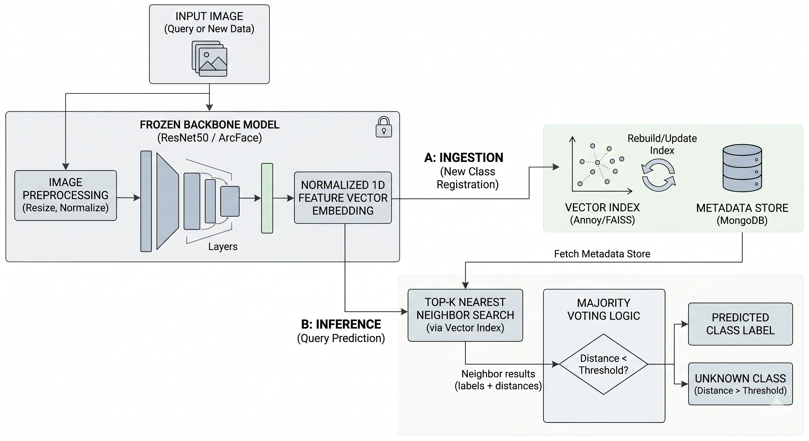

<p align="center">
  
</p>

<h1 align="center">🧊 CRISP</h1>

<h3 align="center">
  Continual Retrieval & Indexing System for Perception<br>
  <em>Train Backbone First, Freeze Later, Retrieve Continuously</em>
</h3>

<p align="center">
  <strong>A modular retrieval-based image classification system for incremental learning experiments.</strong>
</p>

Repository:

```text
https://github.com/Hokimastah/CRISP
```

---

## 1. Main Idea

CRISP classifies images by retrieving the most similar embeddings from a memory bank. In this revised version, the ResNet backbone can be trained first on a folder-based classification dataset. After training, the backbone is frozen and used as a stable feature extractor for indexing and retrieval.

```text
Training images
→ Train ResNet backbone with temporary classification head
→ Discard temporary head
→ Freeze trained backbone
→ Extract embeddings
→ Store embeddings in memory bank
→ Top-k retrieval
→ Voting
→ Predicted class
```

The important rule is: **after the backbone is frozen and a memory bank has been built, do not change the backbone weights unless you rebuild the memory bank.** Old embeddings and new embeddings must be produced by the same frozen encoder.

---

## 2. Key Features

- Trainable-then-frozen ResNet backbone
- Frozen CLIP and ArcFace encoder support
- Incremental add-only memory update after freezing
- Retrieval-based classification
- Top-k nearest-neighbor search
- Weighted voting and majority voting
- Optional unknown-class detection using similarity threshold
- Modular encoder backend
- Modular retrieval backend: NumPy, Annoy, FAISS
- CLI support for backbone training, indexing, and prediction
- Installable as a Python library

---

## 3. Supported Components

### 3.1 Encoders

| Encoder | Description |
|---|---|
| `resnet18` | ResNet18 backbone, can be trained first then frozen |
| `resnet34` | ResNet34 backbone, can be trained first then frozen |
| `resnet50` | ResNet50 backbone, can be trained first then frozen |
| `resnet101` | ResNet101 backbone, can be trained first then frozen |
| `resnet152` | ResNet152 backbone, can be trained first then frozen |
| `clip` | Frozen CLIP image encoder using `open_clip_torch` |
| `arcface` | Frozen face-specific embedding using `insightface` |

### 3.2 Retrieval Backends

| Retriever | Description |
|---|---|
| `numpy` | Exact brute-force cosine retrieval using NumPy |
| `annoy` | Approximate nearest-neighbor retrieval using Annoy |
| `faiss` | Similarity search using FAISS `IndexFlatIP` |

### 3.3 Voting Methods

| Voting | Description |
|---|---|
| `weighted` | Class score is calculated from the sum of similarity values |
| `majority` | Class score is calculated from the number of retrieved neighbors |

For most experiments, `weighted` voting is recommended because it considers both class labels and similarity scores.

---

## 4. Installation

### 4.1 Install from GitHub

```bash
pip install git+https://github.com/Hokimastah/CRISP.git
```

### 4.2 Install Locally for Development

```bash
git clone https://github.com/Hokimastah/CRISP.git
cd CRISP
pip install -e .
```

### 4.3 Optional Dependencies

```bash
pip install -e ".[annoy]"      # Annoy backend
pip install -e ".[faiss]"      # FAISS backend
pip install -e ".[clip]"       # CLIP encoder
pip install -e ".[arcface]"    # ArcFace encoder
pip install -e ".[all]"        # All optional components
```

If `faiss-cpu` cannot be installed through `pip`, especially on some Windows environments, use Conda:

```bash
conda install -c pytorch faiss-cpu
```

---

## 5. Dataset Format

CRISP expects a folder-based image classification dataset.

```text
dataset_train/
├── class_a/
│   ├── image_001.jpg
│   └── image_002.jpg
├── class_b/
│   ├── image_003.jpg
│   └── image_004.jpg
└── class_c/
    ├── image_005.jpg
    └── image_006.jpg
```

The folder name is automatically used as the class label.

```text
dataset_train/cat/cat_001.jpg → label = cat
dataset_train/dog/dog_001.jpg → label = dog
```

Supported image formats:

```text
.jpg, .jpeg, .png, .bmp, .webp, .tif, .tiff
```

---

## 6. Recommended Workflow

### 6.1 Python API: Train Backbone, Freeze, Index, Predict

```python
from crisp import CRISPClassifier

clf = CRISPClassifier(
    encoder="resnet50",
    retriever="numpy",
    pretrained=True,
    device="cuda",
    top_k=5,
    voting="weighted",
)

# Step 1: train backbone on your labeled dataset.
history = clf.fit_backbone(
    train_folder="dataset_train",
    epochs=10,
    batch_size=32,
    lr=1e-4,
    save_path="resnet50_crisp.pt",
)

# Step 2: the backbone is now frozen. Build memory embeddings.
clf.add_folder("dataset_train")
clf.save("memory_bank.pkl")

# Step 3: predict by retrieval and voting.
result = clf.predict("test_image.jpg")
print(result["predicted_label"])
print(result["scores"])
print(result["best_similarity"])
```

### 6.2 Load a Trained Backbone Later

```python
from crisp import CRISPClassifier

clf = CRISPClassifier(
    encoder="resnet50",
    retriever="numpy",
    device="cuda",
    top_k=5,
    voting="weighted",
)

clf.load_backbone("resnet50_crisp.pt", freeze=True)
clf.add_folder("dataset_train")
clf.save("memory_bank.pkl")
```

### 6.3 Predict Using Existing Backbone Weights and Memory Bank

```python
from crisp import CRISPClassifier

clf = CRISPClassifier(encoder="resnet50", retriever="numpy", device="cuda")
clf.load_backbone("resnet50_crisp.pt", freeze=True)
clf.load("memory_bank.pkl")

result = clf.predict("test_image.jpg", threshold=0.65)
print(result)
```

---

## 7. Incremental Learning Usage

After the backbone has been trained and frozen, new labeled samples can be added without retraining the backbone.

```python
from crisp import CRISPClassifier

clf = CRISPClassifier(encoder="resnet50", retriever="numpy", device="cuda")
clf.load_backbone("resnet50_crisp.pt", freeze=True)

# Initial memory
clf.add_folder("dataset_task_1")
clf.save("memory_task_1.pkl")

# Add new samples or new classes using the same frozen backbone
clf.add_folder("dataset_task_2")
clf.save("memory_task_2.pkl")

result = clf.predict("test_image.jpg")
print(result["predicted_label"])
```

Flow after freezing:

```text
New image + label
→ same frozen trained backbone
→ embedding vector
→ append to memory bank
→ rebuild retrieval index if required
```

---

## 8. Command Line Interface

CRISP provides a CLI command named `crisp`.

### 8.1 Train ResNet Backbone

```bash
crisp train-backbone \
  --data dataset_train \
  --output resnet50_crisp.pt \
  --encoder resnet50 \
  --device cuda \
  --epochs 10 \
  --batch-size 32 \
  --lr 1e-4
```

### 8.2 Build Memory Bank with Trained Backbone

```bash
crisp index \
  --data dataset_train \
  --output memory.pkl \
  --encoder resnet50 \
  --retriever numpy \
  --backbone-weights resnet50_crisp.pt
```

### 8.3 Predict Image

```bash
crisp predict \
  --image test_image.jpg \
  --memory memory.pkl \
  --encoder resnet50 \
  --retriever numpy \
  --top-k 5 \
  --backbone-weights resnet50_crisp.pt
```

### 8.4 Predict with Unknown-Class Threshold

```bash
crisp predict \
  --image test_image.jpg \
  --memory memory.pkl \
  --encoder resnet50 \
  --retriever numpy \
  --top-k 5 \
  --threshold 0.65 \
  --backbone-weights resnet50_crisp.pt
```

---

## 9. Using Different Retrieval Backends

### 9.1 NumPy Retriever

```python
clf = CRISPClassifier(
    encoder="resnet50",
    retriever="numpy",
    device="cuda"
)
```

### 9.2 Annoy Retriever

```python
clf = CRISPClassifier(
    encoder="resnet50",
    retriever="annoy",
    retriever_kwargs={
        "n_trees": 20,
        "metric": "angular"
    },
    device="cuda",
    top_k=10
)
```

### 9.3 FAISS Retriever

```python
clf = CRISPClassifier(
    encoder="resnet50",
    retriever="faiss",
    device="cuda",
    top_k=10
)
```

---

## 10. Using CLIP Encoder

CLIP is used as a frozen encoder. The `fit_backbone()` method is currently supported only for ResNet encoders.

```bash
pip install -e ".[clip]"
```

```python
from crisp import CRISPClassifier

clf = CRISPClassifier(
    encoder="clip",
    encoder_kwargs={
        "model_name": "ViT-B-32",
        "pretrained": "laion2b_s34b_b79k"
    },
    retriever="numpy",
    device="cuda",
    top_k=5,
    voting="weighted"
)

clf.add_folder("dataset")
result = clf.predict("test_image.jpg")
print(result)
```

---

## 11. Using ArcFace Encoder

ArcFace is useful for face-recognition-style retrieval. Install optional dependencies first:

```bash
pip install -e ".[arcface]"
```

```python
from crisp import CRISPClassifier

clf = CRISPClassifier(
    encoder="arcface",
    retriever="numpy",
    device="cuda",
    top_k=5,
    voting="weighted"
)

clf.add_folder("face_dataset")
result = clf.predict("query_face.jpg")
print(result)
```

---

## 12. Unknown Class Detection

CRISP can mark a query image as unknown if the best similarity score is below a threshold.

```python
result = clf.predict("test_image.jpg", threshold=0.65)

print(result["status"])
print(result["predicted_label"])
print(result["best_similarity"])
```

Possible output:

```python
{
    "status": "unknown",
    "predicted_label": None,
    "best_similarity": 0.42
}
```

For cosine similarity, a higher value means the query is more similar to retrieved samples.

---

## 13. System Flowchart



---

## 14. How CRISP Works

### 14.1 Backbone Training

For ResNet encoders, CRISP trains the feature extractor using a temporary linear classification head.

```text
image → ResNet feature extractor → temporary linear head → cross-entropy loss
```

After training, the temporary head is discarded. Only the trained feature extractor is saved and used for embedding extraction.

### 14.2 Freezing

After training, the backbone is frozen:

```python
for parameter in backbone.parameters():
    parameter.requires_grad = False
```

This prevents representation drift during memory-bank updates.

### 14.3 Feature Extraction

For ResNet50, the final fully connected layer is removed. The output feature is taken from the pooled representation before the classifier layer.

```text
image → frozen trained ResNet → embedding vector
```

### 14.4 L2 Normalization

The embedding is normalized:

```text
embedding = embedding / ||embedding||
```

This makes dot product equivalent to cosine similarity when using normalized vectors.

### 14.5 Memory Bank

Each stored sample contains:

```python
{
    "embedding": vector,
    "label": "class_name",
    "metadata": {
        "path": "dataset/class_name/image.jpg"
    }
}
```

### 14.6 Retrieval and Voting

During inference, CRISP searches the most similar embeddings from the memory bank.

```text
query embedding → top-k nearest neighbors → weighted/majority voting
```

For weighted voting:

```text
Score(class) = sum(similarity of neighbors from that class)
```

For majority voting:

```text
Score(class) = number of retrieved neighbors from that class
```

---

## 15. Recommended Experimental Variants

| Variant | Encoder | Retriever | Voting |
|---|---|---|---|
| CRISP-ResNet-Numpy | Trained ResNet50 | NumPy | Weighted |
| CRISP-ResNet-Annoy | Trained ResNet50 | Annoy | Weighted |
| CRISP-ResNet-FAISS | Trained ResNet50 | FAISS | Weighted |
| CRISP-CLIP-Numpy | Frozen CLIP ViT-B/32 | NumPy | Weighted |
| CRISP-ArcFace-Numpy | Frozen ArcFace | NumPy | Weighted |
| CRISP-ResNet-Majority | Trained ResNet50 | NumPy | Majority |

---

## 16. Suggested Evaluation Metrics

For image classification experiments:

- Accuracy
- Precision
- Recall
- F1-score
- Confusion matrix

For incremental learning experiments:

- Average accuracy across tasks
- Forgetting score
- Backward transfer
- Forward transfer
- Per-task accuracy
- Top-k retrieval accuracy

---

## 17. Project Structure

```text
CRISP/
├── pyproject.toml
├── README.md
├── LICENSE
├── docs/
│   └── architecture.md
├── examples/
│   ├── basic_usage.py
│   ├── compare_variants.py
│   └── train_then_index.py
├── tests/
│   ├── test_memory.py
│   └── test_voting.py
└── src/
    └── crisp/
        ├── __init__.py
        ├── classifier.py
        ├── cli.py
        ├── memory.py
        ├── utils.py
        ├── voting.py
        ├── encoders/
        │   ├── __init__.py
        │   ├── base.py
        │   ├── factory.py
        │   ├── resnet.py
        │   ├── clip_encoder.py
        │   └── arcface_encoder.py
        └── retrievers/
            ├── __init__.py
            ├── base.py
            ├── factory.py
            ├── numpy_backend.py
            ├── annoy_backend.py
            └── faiss_backend.py
```

---

## 18. API Reference

### 18.1 `CRISPClassifier`

```python
CRISPClassifier(
    encoder="resnet50",
    retriever="numpy",
    pretrained=True,
    device=None,
    top_k=5,
    voting="weighted",
    encoder_kwargs=None,
    retriever_kwargs=None
)
```

### 18.2 Main Methods

```python
clf.fit_backbone(train_folder, epochs=10, batch_size=32, lr=1e-4)
```

Train a ResNet backbone with a temporary classification head, then freeze the backbone.

```python
clf.save_backbone(path)
clf.load_backbone(path, freeze=True)
```

Save or load ResNet feature extractor weights.

```python
clf.add_image(image_path, label)
clf.add_folder(folder)
```

Add labeled images to the memory bank.

```python
clf.predict(image_path, top_k=None, threshold=None)
```

Predict the class of a query image by retrieval and voting.

```python
clf.save(path)
clf.load(path)
```

Save or load the memory bank.

---

## 19. Output Format

Example prediction output:

```python
{
    "status": "known",
    "predicted_label": "cat",
    "scores": {
        "cat": 3.81,
        "dog": 1.12
    },
    "best_similarity": 0.94,
    "neighbors": [
        {
            "index": 0,
            "label": "cat",
            "similarity": 0.94,
            "metadata": {
                "path": "dataset/cat/cat_001.jpg"
            }
        }
    ],
    "encoder": "resnet50",
    "retriever": "numpy"
}
```

---

## 20. Notes and Limitations

- `fit_backbone()` currently supports ResNet encoders only.
- CLIP and ArcFace are used as frozen encoders.
- The same backbone weights must be used when indexing and predicting.
- If backbone weights change, rebuild the memory bank.
- The memory bank stores embeddings, labels, and metadata only; it does not store backbone weights.
- `numpy` retrieval is exact but may be slower for large memory banks.
- `annoy` is approximate and may trade accuracy for speed.
- `faiss` is usually better for larger vector collections.
- The threshold for unknown-class detection must be tuned empirically for each dataset.
- The first use of pretrained ResNet may download model weights automatically.

---

## 21. License

This project is released under the MIT License.

---

## 22. Citation

If you use CRISP in an academic project, you can cite this repository as:

```bibtex
@software{crisp2026,
  title = {CRISP: Continual Retrieval & Indexing System for Perception},
  author = {Satrio Puji Danutirto},
  year = {2026},
  url = {https://github.com/Hokimastah/CRISP}
}
```
